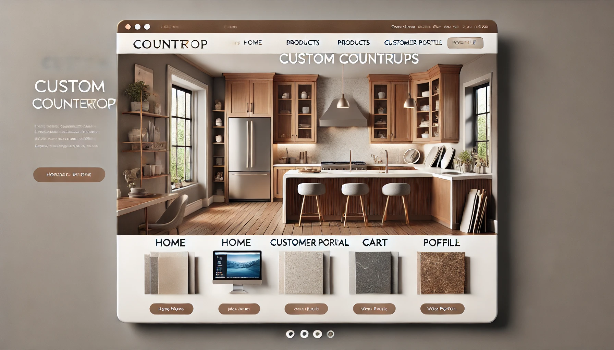

# Web Pages Design - Milestone 4

Lucid chart showing the flow of our webpages:  

<h1>Homepage:</h1>

h1>Homepage:</h1> 

 The <b>Homepage</b> serves as the main entry point for users, providing a welcoming introduction and easy navigation to key sections of the website. 

 <h4> Features:</h4> 
 
    - <b>Welcome Banner:</b> A visually engaging header with a brief introduction to the website and its offerings  
    - <b>Quick Navigation:</b> Prominent links directing users to the <b>Customer Portal</b>, <b>Products Page</b>, and <b>Profile Page</b>.  
    - <b>Featured Products & Promotions:</b> Highlighted deals, trending items, or seasonal promotions.  
    - <b>User Personalization:</b> A section displaying the user’s profile picture, a personalized memo, and set goals (if applicable).  
 

<h4> Parameters Needed: </h4> 
 
    - User ID / Session Token (if logged in) to personalize content.  
    - Featured product data (name, image, price, and promotional details).  
    - User memo and goals (if available in the database).  
 

<h4> Data Needed to Load Page: </h4> 
 
    - User Database (to display personalized content if logged in).  - Product Database (to load featured products and promotions).  
    - Static Assets (homepage banner image, branding elements).  
 

<h4> Link Destinations: </h4> 
 
    - <b>Customer Portal:</b> Directs employees/vendors to inventory and order management.  
    - <b>Products Page:</b> Leads customers to browse and purchase items.  
    - <b>Profile Page:</b> Provides access to user-specific details, including past orders and account management.<be>
    - <b>Cart:</b> A persistent link to review items ready for checkout.  
 
        

    
<h1>Products Page:</h1>

The <b>Products Page</b> displays a catalog of available items with detailed descriptions and purchasing options.

<h4> Features:</h4>

- <b>Product Listings:</b> Images, names, prices, and short descriptions. 
- <b>Filters & Sorting:</b> Allow customers to refine search results by price, category, or popularity. 
- <b>Add to Cart Button:</b> Enables quick purchases. 
- <b>Three categories</b> including pictures, links to product.

<h4> Parameters needed: </h4>

    - Dict? item info: price, picture location, details, etc  
    - Int or double? customer price level.  

<h4> Data Needed to load page: </h4>

    - User Database 
    - Product Database 
    - product images  
    

    
<h1>Cart:</h1>
<h4> Features:</h4>

 Items Currently in cart

 Remove from cart 

 Update Quantity

 Sign in bar at the top 

<h4> Parameters needed: </h4>

    - Array? items in cart  
    - Dict? item info  
    - Array? Quantity, potentially dict and combine with cart 
    - list? Customizations available

<h4> Data Needed to load page: </h4>

    - product database  
    - images of products  
    - user database

    
<h1>Customer Portal Page:</h1>

  
The Charts will pull from the database to populate
    

    

Customer Can adjust Inventory and Shipping status.
    

    </h2>
    Test Cases:
    </h>
    <li>
    As an employee, I can log into the webpage and able to access this page
    </li>
    <li>
    As an employee, I can adjust inventory.
    </li>
    <li>
    As an employee, I can see inventory
    </li>
    <li>
    As an employee, I can adjust shipping status
    </li>
    <li>
    As an employee, I can adjust address/name
    </li>
    <li>
    As a customer, this page will not be presented to me
    </li>
    

    </h2>
    Page Linking:
    </h>
    <li>
    This page has a link from main page, if user is authenticated as an employee 
    </li>
    <li>
    This page has a logout option
    </li>
    <li>
    This page can return to main page
    </li>
    

    

<h1>Profile Page:</h1>

This page allows users (customers/vendors) to view and manage:

- Current Orders: A list of active orders with status and delivery details. 
- Past Orders: Completed or canceled orders with dates, totals, and receipts. 
- Account Info: Editable personal data (name, email, address). 
- Cart: Items pending purchase, with stock warnings if needed.

<h3>Parameters Needed:</h3>

  - User ID / Session Token to identify which profile to load. 
  - User Role (customer, vendor) to determine which profile links to display.

<h3>Data Needed:</h3>

  - User Profile Data (name, email, address, etc.) 
  - Current Orders (order ID, products, status, estimated delivery) 
  - Past Orders (dates, totals, status) 
  - Cart Items (product details, quantity, price, stock alerts)

<h3>Link Destinations:</h3>

  - Header Navigation: Home, Products, Contact, Cart. 
  - Sidebar: Current Orders, Past Orders, Account Info, Cart - jumps to those interal profile sections. 
  - Vendor Links (if user is a vendor): Manage Inventory, Price Updates, leading to the Client Portal.
    

