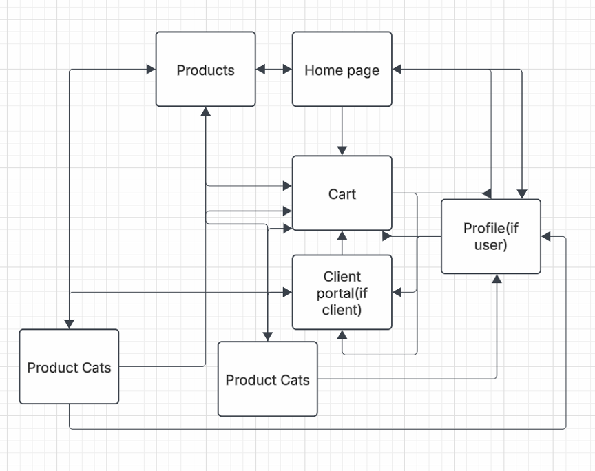
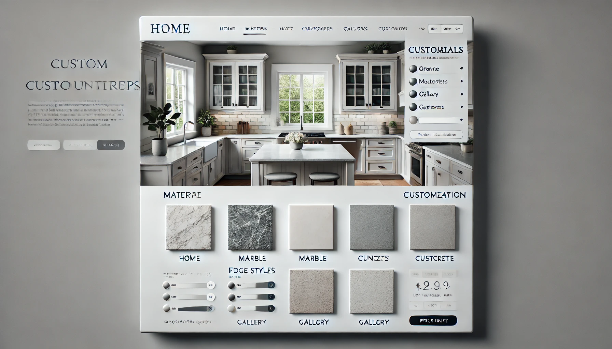
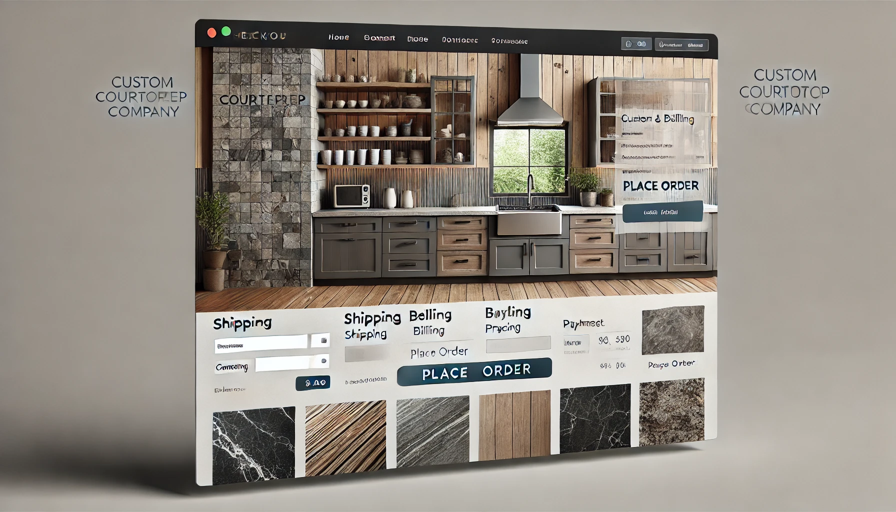
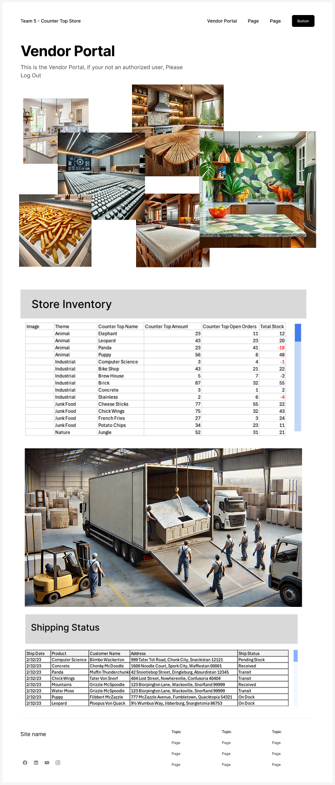
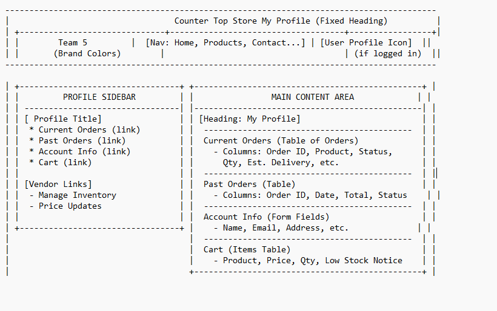

# Web Pages Design - Milestone 4

Lucid chart showing the flow of our webpages:  

<h1>Homepage:</h1>

The <b>Homepage</b> serves as the main entry point for users, providing navigation to various sections of the website.

- A welcoming banner with a brief introduction. 
- Quick links to the <b>Customer Portal</b>, <b>Products Page</b>, and <b>Profile Page</b>. 
- Featured products or promotions. 
- Picture, Memo, Goals.

<h1>Products Page:</h1>

The <b>Products Page</b> displays a catalog of available items with detailed descriptions and purchasing options.

<h4> Features:</h4>

- <b>Product Listings:</b> Images, names, prices, and short descriptions. 
- <b>Filters & Sorting:</b> Allow customers to refine search results by price, category, or popularity. 
- <b>Add to Cart Button:</b> Enables quick purchases. 
- <b>Three categories</b> including pictures, links to product.

<h4> Parameters needed: </h4>

    - Dict? item info: price, picture location, details, etc  
    - Int or double? customer price level.  

<h4> Data needed to load page: </h4>

    - User Database 
    - Product Database 
    - product images  
    

<h4> Variables needed to load page: </h4>

    - Product Image 
    - Product Name 
    - Product Price 
    - Display img 
    - Menu links 
    - Menu Destination
    

    
<h1>Cart:</h1>
<h4> Features:</h4>

 Items Currently in cart

 Remove from cart 

 Update Quantity

 Sign in bar at the top 

<h4> Parameters needed: </h4>

    - Array? items in cart  
    - Dict? item info  
    - Array? Quantity, potentially dict and combine with cart 
    - list? Customizations available

<h4> Data Needed to load page: </h4>

    - product database  
    - images of products  
    - user database

<h4> Data Needed to load page: </h4>

    - Products in Cart 
    - Product Images 
    - Product Names 
    - Product Prices 
    - Product Customizations 
    - Display img 
    - Menu links 
    - Menu Destination

    

    
<h1>Customer Portal Page:</h1>

  
The Charts will pull from the database to populate
    

    

Customer Can adjust Inventory and Shipping status.
    

<h1>Profile Page:</h1>

This page allows users (customers/vendors) to view and manage:

- Current Orders: A list of active orders with status and delivery details. 
- Past Orders: Completed or canceled orders with dates, totals, and receipts. 
- Account Info: Editable personal data (name, email, address). 
- Cart: Items pending purchase, with stock warnings if needed.

<h3>Parameters Needed:</h3>

  - User ID / Session Token to identify which profile to load. 
  - User Role (customer, vendor) to determine which profile links to display.

<h3>Data Needed:</h3>

  - User Profile Data (name, email, address, etc.) 
  - Current Orders (order ID, products, status, estimated delivery) 
  - Past Orders (dates, totals, status) 
  - Cart Items (product details, quantity, price, stock alerts)

<h3>Link Destinations:</h3>

  - Header Navigation: Home, Products, Contact, Cart. 
  - Sidebar: Current Orders, Past Orders, Account Info, Cart - jumps to those interal profile sections. 
  - Vendor Links (if user is a vendor): Manage Inventory, Price Updates, leading to the Client Portal.
    

